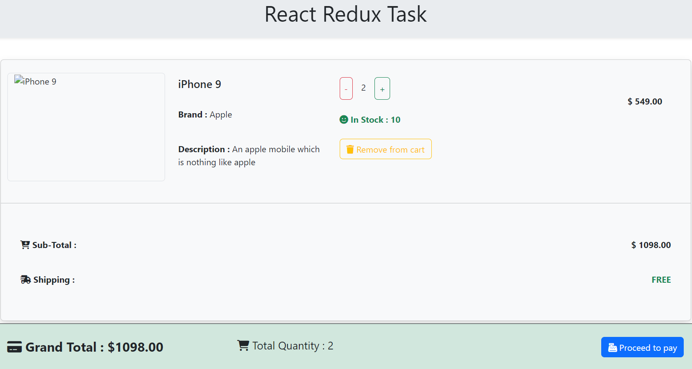

# React Redux Task

> Using `Redux-Toolkit` for Global State Management - Created a cart page with item quantity, price per item, total quantity and total price of the added products.

- [Click here]() to preview tha deployed webpage

- Created cards for all added products.

- We can increase or decrease product quantity using the `-` & `+` buttons provided. Also can see the available stock which is connected with product quantity added to the cart.

- Also can remove the product from the cart page using `Remove from cart` button.

- Each cart has a `Sub-Total` display which gives the total amount of that particular product will be displayed. And updates accoring to the number of quantity added or removed.

- At the botton we can see the `Total Amount` of the product added to the cart & `Total Quantity` of the product added to the cart can be seen.
